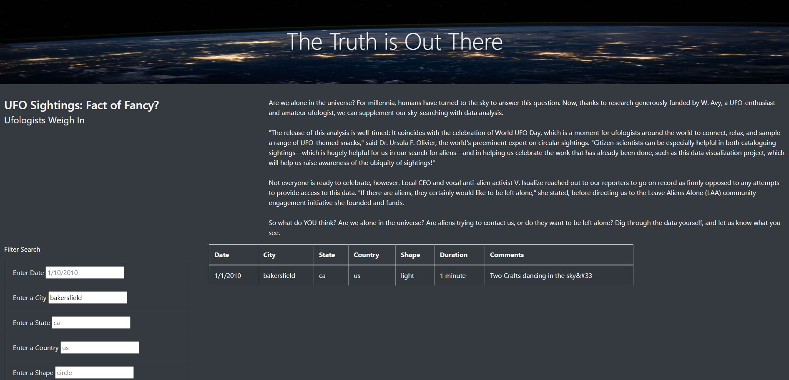
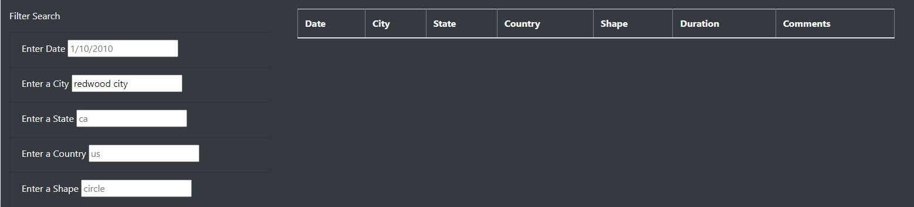

# UFO Sightings Project Website

## Purpose
The purpose of this challenge was to create a website using [JavaScript](static/js/app.js) and [HTML](index.html) that allowed users to search UFO sightings using a filter based on city, state, country, and/or shape.  The information came from [JavaScript data file](static/js/data.js)  "filled to the brim" with sighting information.

## Results
To perform a search, all the user has to do in type in one or more of the search criteria.  For example, if the user only types in "bakersfield" (and presses "ENTER") for the city name, the following shows up:

If the user types in information for which the data doesn't exist, then this shows up: 

In order to start new search, it is best to just "refresh" the page. 

## Summary
For a beginner programmer  in HTML and JavaScript, this website wasn't too "shabby". However, as an regular online user, I see some drawbacks and room for improvements.

The main drawback I see, is having to refresh the webpage to do a new search. I would've have liked 2 buttons added. One button for "search" and one button for "clear results".  

Another recommendation I would have for further development is to get more data! This only has limited data from 2010. This website could be greatly improved with multiple data sources.

A last recommendation I have for improvement would be to have an announcement pop up when the data doesn't exists.  The blank table might confuse some users. 

